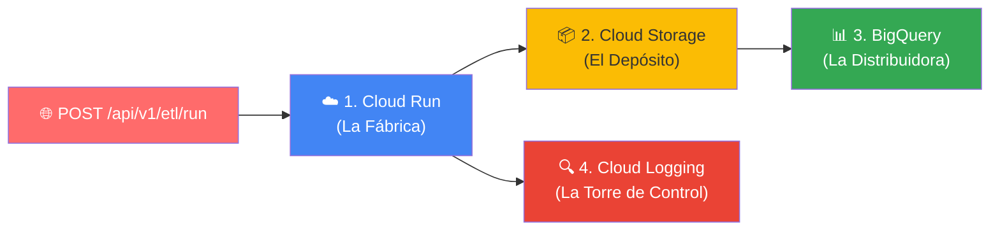
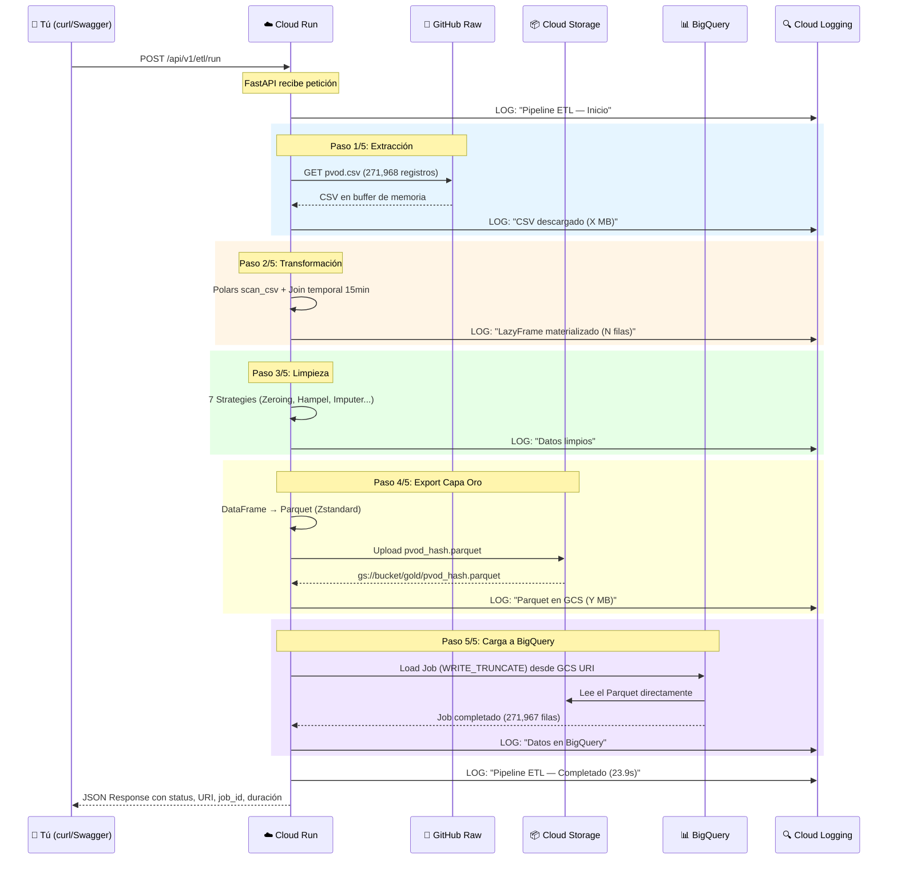

# Los 4 Servicios de Google Cloud: Cómo actúa cada uno al ejecutar el ETL

## La Analogía: Tu "Refinería de Datos Solares"

Tu proyecto convierte datos crudos del dataset PVOD (irradiancia, temperatura, potencia de 10 estaciones solares) en datos limpios listos para Machine Learning. Cada servicio de Google Cloud cumple un papel en esta cadena:



---

## Flujo Completo: ¿Qué pasa cuando haces POST a `/api/v1/etl/run`?

### Servicio 1: ☁️ Google Cloud Run — "La Fábrica"

> **Rol:** Es el **cerebro y la fuerza de trabajo**. Ejecuta tu código Python (FastAPI + Polars) dentro de un contenedor Docker.

**¿Qué hace exactamente?**

Cuando haces:
```bash
curl -X POST "https://pvod-solar-api-264931673910.us-central1.run.app/api/v1/etl/run"
```

1. **Cloud Run recibe la petición HTTP** y "despierta" un contenedor (escala desde cero si no hay instancias activas)
2. El contenedor corre la imagen Docker con FastAPI + Uvicorn en puerto 8080
3. FastAPI enruta la petición al endpoint definido en [etl_router.py](file:///Users/matias95lopez/Desktop/serverless-solar-etl/src/app/interfaces/etl_router.py)
4. Se construye el pipeline completo en [pipeline.py](file:///Users/matias95lopez/Desktop/serverless-solar-etl/src/app/application/pipeline.py) y ejecuta **5 pasos secuenciales**:

| Paso | Nombre | Qué hace |
|------|--------|----------|
| 1/5 | **Extracción** | Descarga el CSV (~271,968 registros) desde GitHub Raw (o SciDB como fallback) |
| 2/5 | **Transformación** | Carga lazy con Polars (`scan_csv`), alinea timestamps a grilla de 15 min |
| 3/5 | **Limpieza** | Aplica 7 estrategias (Nighttime Zeroing, Hampel Filter, Imputer, etc.) |
| 4/5 | **Export Gold** | Serializa a Parquet con compresión Zstandard → **sube a Cloud Storage** |
| 5/5 | **BigQuery Load** | Ejecuta Load Job desde GCS → **carga a BigQuery** |

**¿Dónde lo ves en Google Cloud Console?**
- **Ruta:** [Console](https://console.cloud.google.com) → **Cloud Run** → Servicio `pvod-solar-api`
- Verás: métricas de latencia, tráfico, revisiones desplegadas, y la URL del servicio

**Configuración clave** (del [deploy_to_cloud_run.sh](file:///Users/matias95lopez/Desktop/serverless-solar-etl/scripts/deploy_to_cloud_run.sh)):
```
--min-instances 0       # Escala a cero (sin costos cuando no hay tráfico)
--max-instances 5       # Máximo 5 contenedores simultáneos
--cpu 1 --memory 1Gi    # Recursos por contenedor
--set-secrets BQ_DATASET_ID=bq_dataset_id:latest  # Inyecta secretos de Secret Manager
```

---

### Servicio 2: 📦 Google Cloud Storage (GCS) — "El Depósito de Seguridad"

> **Rol:** Actúa como la **Capa Oro (Gold Layer)** — un buffer de alta durabilidad donde se guarda el archivo Parquet ya procesado ANTES de ir a BigQuery.

**¿Qué hace exactamente?**

En el **Paso 4/5** del pipeline, el [gcs_parquet_exporter.py](file:///Users/matias95lopez/Desktop/serverless-solar-etl/src/app/infrastructure/gcs_parquet_exporter.py):

1. **Aplica enforcement de tipos** estrictos al DataFrame según el esquema PVOD final
2. **Serializa** el DataFrame de Polars a formato Apache Parquet con compresión **Zstandard**
3. **Sube** el archivo `.parquet` al bucket GCS configurado
4. **Retorna el URI** (`gs://tu-bucket/gold/pvod_<hash>.parquet`)

El archivo se nombra con un **hash MD5 determinista** del CSV original, lo que garantiza idempotencia: si ejecutas el ETL dos veces con los mismos datos, no se crea un archivo duplicado.

**¿Dónde lo ves en Google Cloud Console?**
- **Ruta:** Console → **Cloud Storage** → **Buckets** → `<tu-bucket>`
- Navega a la carpeta `gold/`
- Verás archivos como: `pvod_<hash>.parquet`

**Ejemplo de lo que encontrarás:**
```
gs://serverless-solar-etl-gold-n0mercy95/
  └── gold/
      ├── pvod_0bd737bf28e0.parquet        ← Datos limpios del ETL
      ├── plots/                            ← Scatter plots generados
      │   ├── scatter_pre_cleaning_*.png
      │   └── scatter_post_cleaning_*.png
```

---

### Servicio 3: 📊 Google BigQuery — "La Planta de Distribución"

> **Rol:** Es el **Data Warehouse**. Recibe los datos limpios y los estructura en tablas analíticas particionadas, listas para consultas SQL en milisegundos.

**¿Qué hace exactamente?**

En el **Paso 5/5** del pipeline, el [bigquery_adapter.py](file:///Users/matias95lopez/Desktop/serverless-solar-etl/src/app/infrastructure/bigquery_adapter.py):

1. **Crea un Load Job** con un `job_id` único (`pvod_load_<uuid>`)
2. **Configura** el job con:
   - `source_format = PARQUET` (lee directamente del GCS)
   - `WRITE_TRUNCATE` (reemplaza la tabla completa → idempotente)
   - **Particionamiento** diario por la columna `date_time`
   - **Clustering** por `station_id`
3. **Ejecuta** `load_table_from_uri(gcs_uri)` → BigQuery lee el Parquet desde GCS y lo carga
4. **Valida** que el conteo de filas cargadas coincida con lo esperado

**¿Dónde lo ves en Google Cloud Console?**
- **Ruta:** Console → **BigQuery** → Panel Explorador
- Navega a: `tu-proyecto` → `solar_etl_dataset` → tabla `pvod_metrics`
- Puedes hacer clic en **"Vista previa"** para ver los datos

**Consulta de ejemplo que puedes correr en BigQuery:**
```sql
-- Ver promedio de potencia por estación
SELECT station_id, AVG(local_power_output) as avg_power
FROM `tu-proyecto.solar_etl_dataset.pvod_metrics`
WHERE date_time BETWEEN '2018-07-01' AND '2018-07-31'
GROUP BY station_id
ORDER BY station_id;
```

**Detalles de la tabla `pvod_metrics`:**
- **Particionada** por `date_time` (día) → consultas por rango de fechas son baratas
- **Clusterizada** por `station_id` → filtrar por estación es ultra-rápido
- **~271,967 filas** con columnas como irradiancia, temperatura, viento, potencia, etc.

---

### Servicio 4: 🔍 Google Cloud Logging — "La Torre de Control"

> **Rol:** Registra **cada evento, error y métrica** del pipeline en tiempo real con JSON estructurado.

**¿Qué hace exactamente?**

El módulo [cloud_logging.py](file:///Users/matias95lopez/Desktop/serverless-solar-etl/src/app/infrastructure/cloud_logging.py) configura un sistema de **Structured JSON Logging**:

1. **Cada log** se emite como una línea JSON a `stdout`
2. **Cloud Run parsea automáticamente** ese JSON y lo indexa en Cloud Logging
3. Los logs incluyen llaves reservadas de GCP:
   - `severity` → nivel (INFO, ERROR, etc.)
   - `message` → texto del log
   - `logging.googleapis.com/trace` → ID de traza para correlación
   - `attributes` → métricas vitales del pipeline

**Ejemplo de un log real emitido:**
```json
{
  "severity": "INFO",
  "message": "✓ Paso 5/5 completado: Datos en BigQuery",
  "timestamp": "2026-05-26T19:08:07.304Z",
  "logger": "app.application.pipeline",
  "attributes": {
    "job_id": "pvod_load_a1b2c3d4..."
  }
}
```

**¿Dónde lo ves en Google Cloud Console?**
- **Ruta:** Console → **Logging** → **Explorador de Logs**
- Filtra por: `resource.type="cloud_run_revision"` y `resource.labels.service_name="pvod-solar-api"`
- Verás la secuencia completa del pipeline: paso 1/5, 2/5, 3/5, 4/5, 5/5

**Filtros útiles en el Explorador de Logs:**
```
-- Ver solo errores del ETL
severity>=ERROR
resource.type="cloud_run_revision"

-- Ver el flujo completo de una ejecución
jsonPayload.message=~"Paso.*completado"
```

---

## Resumen Visual: El Flujo Completo



---

## Tabla Resumen: Dónde verificar cada servicio en Google Cloud Console

| # | Servicio | Ruta en Console | Qué encontrarás |
|---|----------|-----------------|------------------|
| 1 | **Cloud Run** | Cloud Run → `pvod-solar-api` | URL del servicio, métricas, revisiones, logs |
| 2 | **Cloud Storage** | Cloud Storage → Buckets → `tu-bucket` → `gold/` | Archivos `.parquet` + scatter plots `.png` |
| 3 | **BigQuery** | BigQuery → `solar_etl_dataset` → `pvod_metrics` | Tabla con ~271K filas, vista previa, SQL editor |
| 4 | **Cloud Logging** | Logging → Explorador de Logs (filtrar por `pvod-solar-api`) | Logs JSON estructurados paso a paso |

> [!TIP]
> También puedes consultar los datos ya cargados mediante el **segundo endpoint** de tu API:
> ```bash
> curl -X POST "https://pvod-solar-api-264931673910.us-central1.run.app/api/v1/metrics/aggregate" \
>      -H "Content-Type: application/json" \
>      -d '{"start_date": "2018-07-01T00:00:00", "end_date": "2018-07-02T23:59:59", "dry_run": false}'
> ```
> Este endpoint consulta BigQuery directamente y te retorna promedios de potencia por estación.
