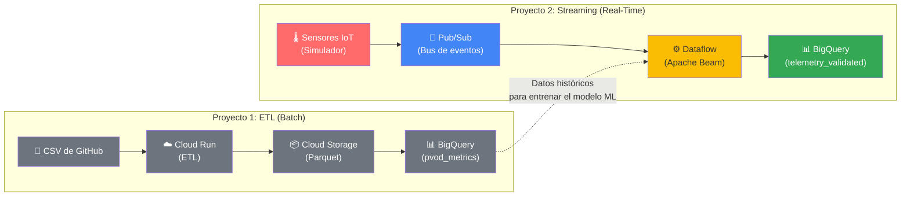
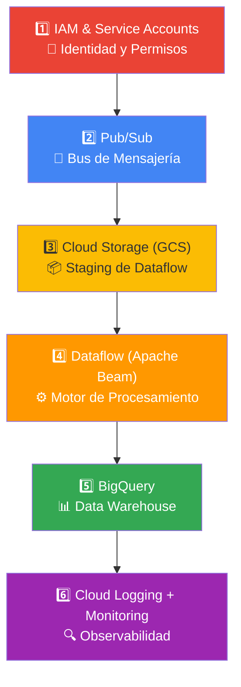
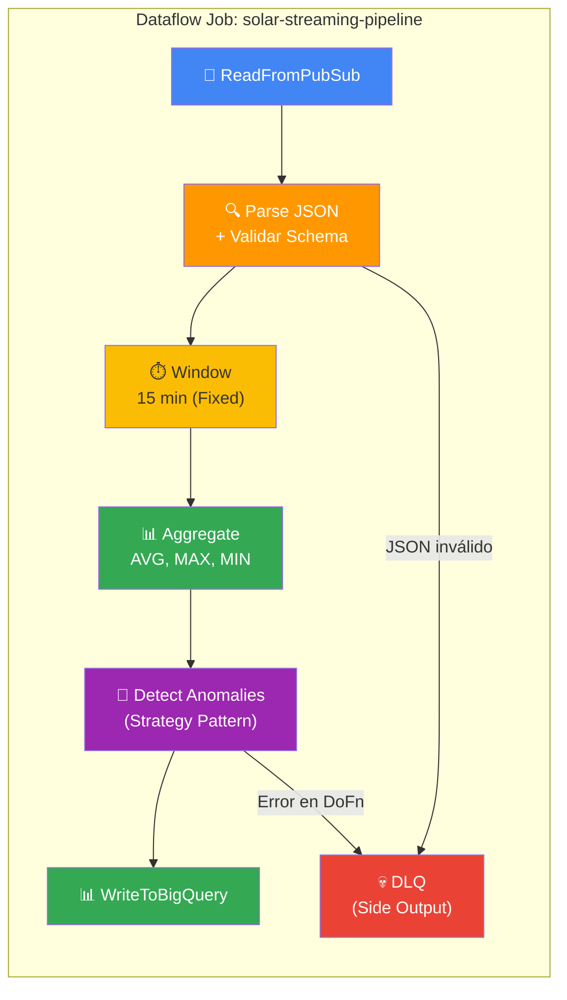
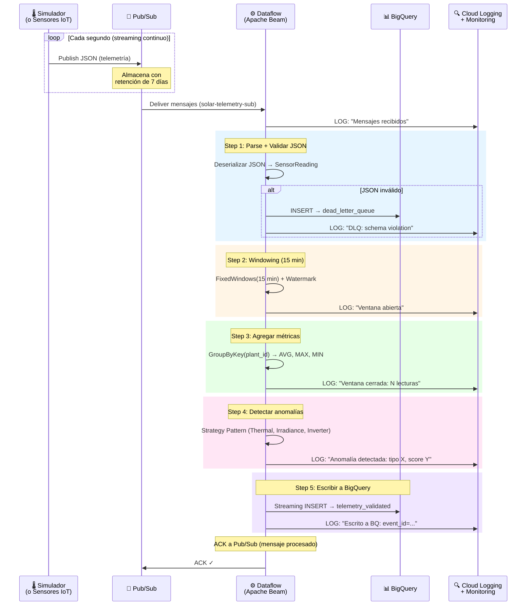
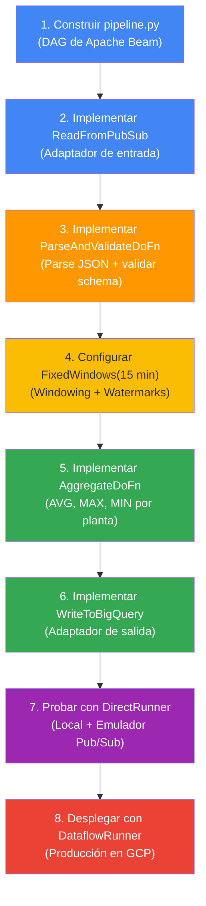

# Los 6 Servicios de Google Cloud: Pipeline de Streaming en Tiempo Real

## Contexto: ¿De dónde venimos?

Este proyecto **serverless-solar-streaming** es la continuación directa del **serverless-solar-etl**. El ETL procesaba datos **batch** (un CSV estático con ~271,968 registros). Ahora, evolucionamos a **streaming en tiempo real**: datos fluyendo continuamente desde sensores IoT.



> [!NOTE]
> En el ETL, el flujo era **pull** (Cloud Run iba a buscar el CSV). En streaming, el flujo es **push** (los sensores empujan datos continuamente y el sistema reacciona).

---

## El Nuevo Flujo: Orden de Ejecución de los Servicios

Los servicios se activan en el siguiente orden durante una ejecución real del pipeline de streaming:



---

## Servicio 1: 🔐 IAM & Service Accounts — "El Guardia de Seguridad"

> **Rol:** Antes de que cualquier servicio hable con otro, necesitan una **identidad** con permisos. IAM es lo que permite que Dataflow lea de Pub/Sub y escriba a BigQuery sin ser bloqueado.

**¿Qué se configuró?**

Se creó una cuenta de servicio dedicada (`solar-dataflow-sa`) que actúa como la identidad del pipeline. En vez de usar la cuenta de servicio por defecto del proyecto (que tiene demasiados permisos), esta cuenta tiene **solo los roles necesarios**:

| Rol IAM | Qué permite | Quién lo usa |
|---------|-------------|--------------|
| `roles/dataflow.worker` | Ejecutar workers de Dataflow | Pipeline |
| `roles/storage.objectAdmin` | Leer/escribir en el bucket de staging | Pipeline |
| `roles/pubsub.subscriber` | Consumir mensajes del topic | Pipeline |
| `roles/pubsub.publisher` | Publicar mensajes al topic | Simulador |
| `roles/bigquery.dataEditor` | Insertar filas en tablas de BigQuery | Pipeline |
| `roles/bigquery.jobUser` | Ejecutar jobs de consulta/carga | Pipeline |
| `roles/logging.logWriter` | Emitir logs estructurados | Pipeline |
| `roles/monitoring.metricWriter` | Reportar métricas custom | Pipeline |

**¿Cuándo ocurre?** Esto se configura **una sola vez** antes de ejecutar cualquier servicio. Sin esto, el pipeline fallaría con errores de `403 Permission Denied`.

**¿Dónde lo ves en Google Cloud Console?**
- **Ruta:** Console → **IAM y Administración** → **Cuentas de servicio**
- Busca: `solar-dataflow-sa@TU_PROJECT_ID.iam.gserviceaccount.com`

**Relación con el PRD:** Fase 0 (Configuración Base). Se documentó en [setup-dataflow.md](file:///Users/matias95lopez/Desktop/serverless-solar-streaming/docs/configs/setup-dataflow.md) sección 3.

---

## Servicio 2: 📨 Google Cloud Pub/Sub — "La Central de Correos"

> **Rol:** Es el **bus de mensajería asíncrono** que desacopla a los productores (sensores/simulador) de los consumidores (pipeline de Beam). Recibe miles de mensajes JSON por segundo y los retiene hasta que Dataflow los procese.

**¿Qué hace exactamente?**

Pub/Sub actúa como un buffer elástico entre la generación de telemetría y su procesamiento:

1. **El simulador** (o los sensores IoT reales) publica mensajes JSON al **topic** `solar-telemetry-ingest`
2. Pub/Sub almacena cada mensaje y lo replica en su infraestructura interna (durabilidad garantizada)
3. La **suscripción** `solar-telemetry-sub` entrega los mensajes a Apache Beam/Dataflow cuando éste los solicita
4. Beam confirma el procesamiento (**ACK**). Si no lo confirma en 60 segundos, Pub/Sub reintenta
5. Después de **5 intentos fallidos**, el mensaje se desvía al topic de **Dead Letter Queue** (`solar-telemetry-dlq`)

**Estructura de mensajes (contrato JSON estricto):**

Cada mensaje debe cumplir el esquema definido en [pubsub_schema.json](file:///Users/matias95lopez/Desktop/serverless-solar-streaming/config/schemas/pubsub_schema.json):

```json
{
  "event_id": "550e8400-e29b-41d4-a716-446655440000",
  "plant_id": "plant-atacama-001",
  "sensor_id": "sensor-inv-003",
  "sensor_type": "inverter",
  "timestamp": "2026-06-15T12:30:00Z",
  "lmd_ghi": 923.5,
  "power_mw": 4.7,
  "module_temp_c": 52.3,
  "ambient_temp_c": 28.1,
  "dc_voltage": 620.0,
  "dc_current": 7.6
}
```

**Recursos creados en Pub/Sub:**

| Recurso | Nombre | Propósito |
|---------|--------|-----------|
| Topic principal | `solar-telemetry-ingest` | Punto de entrada de toda la telemetría IoT |
| Suscripción | `solar-telemetry-sub` | Consumida por el pipeline de Apache Beam |
| Topic DLQ | `solar-telemetry-dlq` | Recibe mensajes que fallaron 5 veces |
| Suscripción DLQ | `solar-telemetry-dlq-sub` | Para inspección manual de errores |

**¿Dónde lo ves en Google Cloud Console?**
- **Ruta:** Console → **Pub/Sub** → **Topics** o **Suscripciones**
- URL directa de la DLQ: [solar-telemetry-dlq-sub](https://console.cloud.google.com/cloudpubsub/subscription/detail/solar-telemetry-dlq-sub?project=serverless-solar-streaming)

**Relación con las fases del PRD:**
- **Fase 0:** Se crearon los topics y suscripciones ✅
- **Fase 1:** El simulador publica a este topic ✅ (ya implementado en [publisher.py](file:///Users/matias95lopez/Desktop/serverless-solar-streaming/simulator/publisher.py))
- **Fase 2:** Dataflow consumirá desde la suscripción `solar-telemetry-sub` ⬅️ **próximo paso**

**Diferencia con el ETL:** En el ETL no existía Pub/Sub. Cloud Run iba directamente a buscar el CSV. Aquí, Pub/Sub es el intermediario obligatorio para manejar datos en streaming con garantías de entrega.

---

## Servicio 3: 📦 Google Cloud Storage (GCS) — "El Estacionamiento de Dataflow"

> **Rol:** En el proyecto de streaming, GCS **NO** almacena los datos finales (eso lo hace BigQuery directamente vía streaming inserts). Aquí GCS cumple un rol **operativo**: almacena los archivos temporales que Dataflow necesita para funcionar.

**¿Qué hace exactamente?**

Cuando Dataflow ejecuta el pipeline, necesita un lugar para guardar:

1. **Staging files** — El código Python empaquetado (`.tar.gz`) que Dataflow distribuye a sus workers
2. **Temp files** — Archivos intermedios durante el shuffle (redistribución de datos entre workers)
3. **Logs y checkpoints** — Estado del pipeline para recuperación ante fallos

**Bucket creado:**
```
gs://TU_PROJECT_ID-dataflow-staging/
  ├── dataflow/
  │   ├── staging/    ← Código empaquetado del pipeline
  │   └── temp/       ← Archivos temporales de shuffle
```

Se configuró una política de **lifecycle** que elimina automáticamente los archivos después de 7 días, evitando acumulación de costos.

**¿Dónde lo ves en Google Cloud Console?**
- **Ruta:** Console → **Cloud Storage** → **Buckets** → `TU_PROJECT_ID-dataflow-staging`
- Verás archivos temporales cuando el pipeline esté corriendo

**Diferencia con el ETL:** En el ETL, GCS era la **Capa Oro** donde se almacenaban los Parquets limpios. Aquí, GCS es solo infraestructura interna de Dataflow — los datos limpios van directamente a BigQuery vía streaming.

**Relación con las fases del PRD:**
- **Fase 0:** Se crea el bucket ✅
- **Fase 2:** Dataflow lo usa automáticamente al desplegarse ⬅️ **próximo paso**

---

## Servicio 4: ⚙️ Google Cloud Dataflow — "La Fábrica de Procesamiento en Tiempo Real"

> **Rol:** Es el **motor de procesamiento distribuido** que ejecuta el pipeline de Apache Beam en modo streaming. Lee mensajes de Pub/Sub, los agrupa en ventanas temporales de 15 minutos, aplica las estrategias de detección de anomalías y escribe los resultados a BigQuery.

**¿Qué hace exactamente?**

Dataflow reemplaza a Cloud Run del proyecto ETL. Mientras Cloud Run procesaba un CSV estático de una vez, Dataflow procesa un flujo **continuo e infinito** de datos:



**Conceptos clave de Dataflow:**

| Concepto | Qué es | Para qué sirve |
|----------|--------|-----------------|
| **Window (Ventana)** | Agrupación temporal de datos (15 min) | Calcula promedios/max/min de potencia e irradiancia por planta |
| **Watermark** | Marca de tiempo que indica "ya procesé todo hasta este punto" | Decide cuándo una ventana está "completa" |
| **Trigger** | Regla que dispara el cálculo de una ventana | Permite resultados parciales antes de que la ventana cierre |
| **Allowed Lateness** | Tolerancia a datos tardíos | Acepta datos que llegan después del watermark |
| **Side Output** | Canal secundario de salida | Desvía registros fallidos a la DLQ sin detener el pipeline |
| **DoFn** | Unidad de trabajo (función de transformación) | Cada paso del pipeline es una DoFn con su propio try-except |

**Configuración del pipeline:**

```python
pipeline_options = {
    "--runner": "DataflowRunner",        # En producción
    "--streaming": "true",               # Modo streaming (nunca termina)
    "--enable_streaming_engine": "true",  # Shuffle en infraestructura de Google
    "--max_num_workers": "5",            # Límite de costos
    "--machine_type": "n1-standard-2",   # 2 vCPUs, 7.5 GB RAM por worker
    "--autoscaling_algorithm": "THROUGHPUT_BASED",  # Escala automático
}
```

**¿Dónde lo ves en Google Cloud Console?**
- **Ruta:** Console → **Dataflow** → **Jobs**
- Verás: `solar-streaming-pipeline` con un gráfico de nodos interactivo
- Métricas: throughput (elementos/s), system lag, watermark, estado de workers

**Diferencia con el ETL:** En el ETL, Cloud Run ejecutaba un proceso que **empezaba y terminaba** (~24 segundos). Dataflow ejecuta un job que **nunca termina**: está escuchando continuamente nuevos mensajes de Pub/Sub.

**Relación con las fases del PRD:**
- **Fase 2:** Construcción del DAG de Beam con windowing ⬅️ **próximo paso**
- **Fase 3:** Integración del modelo Transformer Bi-LSTM para detección de anomalías
- **Fase 4:** Despliegue a producción con DataflowRunner

---

## Servicio 5: 📊 Google BigQuery — "El Almacén de Verdad"

> **Rol:** Es el **data warehouse columnar** donde se persisten las métricas agregadas por ventana temporal y los registros de la DLQ. A diferencia del ETL (donde los datos llegaban como un Load Job desde un Parquet en GCS), aquí los datos llegan en **streaming inserts** directamente desde Dataflow.

**¿Qué hace exactamente?**

BigQuery recibe dos flujos de datos de Dataflow:

**1. Tabla `telemetry_validated`** — Métricas limpias y agregadas:

| Campo | Tipo | Descripción |
|-------|------|-------------|
| `event_id` | STRING | UUID del evento agregado |
| `plant_id` | STRING | Identificador de la planta |
| `window_start` | TIMESTAMP | Inicio de la ventana de 15 min |
| `window_end` | TIMESTAMP | Fin de la ventana |
| `avg_ghi` | FLOAT64 | Promedio de irradiancia GHI (W/m²) |
| `avg_power_mw` | FLOAT64 | Potencia promedio (MW) |
| `max_power_mw` | FLOAT64 | Potencia máxima (MW) |
| `min_power_mw` | FLOAT64 | Potencia mínima (MW) |
| `avg_module_temp_c` | FLOAT64 | Temperatura promedio del módulo (°C) |
| `reading_count` | INT64 | Lecturas en la ventana |
| `predicted_power_mw` | FLOAT64 | Predicción del modelo ML (MW) |
| `anomaly_type` | STRING | Tipo de anomalía detectada |
| `anomaly_score` | FLOAT64 | Score de confianza (0-1) |
| `ingestion_timestamp` | TIMESTAMP | Momento de escritura a BQ |

- **Particionada** por día en `window_start` (consultas por fecha son baratas)
- **Clusterizada** por `plant_id` y `anomaly_type` (filtrar por planta/anomalía es ultra-rápido)

**2. Tabla `dead_letter_queue`** — Registros que fallaron:

| Campo | Tipo | Descripción |
|-------|------|-------------|
| `event_id` | STRING | UUID del registro DLQ |
| `original_payload` | STRING | JSON original tal como llegó |
| `error_message` | STRING | Descripción del error |
| `failure_timestamp` | TIMESTAMP | Momento de la falla |
| `failed_step` | STRING | Nombre del DoFn que falló |

**Consultas útiles que podrás correr:**

```sql
-- ¿Están llegando datos en la última hora?
SELECT plant_id, COUNT(*) AS ventanas, MAX(window_start) AS última_ventana
FROM `serverless-solar-streaming.solar_streaming.telemetry_validated`
WHERE window_start >= TIMESTAMP_SUB(CURRENT_TIMESTAMP(), INTERVAL 1 HOUR)
GROUP BY plant_id;

-- ¿Qué anomalías se detectaron hoy?
SELECT anomaly_type, COUNT(*) AS total, AVG(anomaly_score) AS score_promedio
FROM `serverless-solar-streaming.solar_streaming.telemetry_validated`
WHERE anomaly_type != 'none'
  AND window_start >= TIMESTAMP_TRUNC(CURRENT_TIMESTAMP(), DAY)
GROUP BY anomaly_type
ORDER BY total DESC;

-- ¿Cuántos errores hay en la DLQ?
SELECT failed_step, COUNT(*) AS errores,
       ARRAY_AGG(error_message LIMIT 3) AS ejemplos
FROM `serverless-solar-streaming.solar_streaming.dead_letter_queue`
WHERE failure_timestamp >= TIMESTAMP_SUB(CURRENT_TIMESTAMP(), INTERVAL 1 HOUR)
GROUP BY failed_step;
```

**¿Dónde lo ves en Google Cloud Console?**
- **Ruta:** Console → **BigQuery** → Panel Explorador
- Navega a: `serverless-solar-streaming` → `solar_streaming` → `telemetry_validated`

**Diferencia con el ETL:** En el ETL, la tabla era `pvod_metrics` con datos batch cargados via `WRITE_TRUNCATE` (reemplazo completo). Aquí, las tablas reciben **streaming inserts** que llegan continuamente sin reemplazar datos anteriores.

**Relación con las fases del PRD:**
- **Fase 0:** Se crearon el dataset y las tablas ✅
- **Fase 2:** Dataflow escribirá los primeros datos ⬅️ **próximo paso**
- **Fase 4:** Implementación de los adaptadores de salida y DLQ handler

---

## Servicio 6: 🔍 Cloud Logging + Cloud Monitoring — "La Torre de Control"

> **Rol:** Registra cada evento del pipeline en tiempo real (Logging) y genera métricas y alertas operacionales (Monitoring). Ambos servicios trabajan juntos para dar visibilidad completa sobre la salud del sistema.

**¿Qué hacen exactamente?**

### Cloud Logging (Registro de Eventos)

Igual que en el ETL, pero ahora los logs vienen de **Dataflow workers** en lugar de Cloud Run:

- Cada `DoFn` del pipeline emite logs JSON estructurados
- Los logs incluyen las claves reservadas de GCP (`severity`, `message`, `logging.googleapis.com/trace`)
- Se pueden filtrar por job, worker, step, o severidad

```json
{
  "severity": "INFO",
  "message": "Ventana cerrada: 12:00-12:15 | plant-atacama-001 | 245 lecturas | avg_power=4.2MW",
  "logger": "application.transforms.windowing",
  "attributes": {
    "window_start": "2026-06-15T12:00:00Z",
    "plant_id": "plant-atacama-001",
    "reading_count": 245
  }
}
```

### Cloud Monitoring (Métricas y Alertas)

Cloud Monitoring aporta **métricas numéricas** que complementan los logs:

| Métrica | Umbral de Alerta | Significado |
|---------|-------------------|-------------|
| **System Lag** | > 5 minutos | El pipeline está procesando datos con retraso |
| **Data Watermark** | > 10 min atrás | Los datos están llegando tarde |
| **Backlog (unacked)** | > 10,000 mensajes | Acumulación de mensajes sin procesar en Pub/Sub |
| **Worker CPU** | > 80% sostenido | El pipeline necesita más workers |
| **DLQ Elements** | > 100/min | Demasiados errores — investigar de inmediato |

**¿Dónde lo ves en Google Cloud Console?**
- **Logging:** Console → **Logging** → **Explorador de Logs** → Filtrar por `resource.type="dataflow_step"`
- **Monitoring:** Console → **Monitoring** → **Dashboards** → Dashboard de Dataflow
- **Alertas:** Console → **Monitoring** → **Alerting** → Políticas configuradas

**Diferencia con el ETL:** En el ETL, los logs eran de una ejecución de ~24 segundos que empezaba y terminaba. Aquí, los logs son **continuos e infinitos** porque el job de Dataflow nunca se detiene.

**Relación con las fases del PRD:**
- **Fase 2:** Logging básico desde los DoFns ⬅️ **próximo paso**
- **Fase 4:** Logging estructurado completo con `CloudLoggingHandler`, alertas y dashboards en Looker Studio

---

## Resumen Visual: El Flujo Completo del Streaming



---

## Mapa de Servicios por Fase del PRD

| Fase | Nombre | Servicios GCP Involucrados | Estado |
|------|--------|---------------------------|--------|
| **Fase 0** | Configuración Base | IAM, Pub/Sub (topics/subs), GCS (bucket staging), BigQuery (dataset/tablas) | ✅ Completada |
| **Fase 1** | Simulador de Ingesta | **Pub/Sub** (el simulador publica aquí) | ✅ Completada |
| **Fase 2** | Core de Beam + Windowing | **Dataflow** (ejecuta el DAG), Pub/Sub (lectura), BigQuery (escritura), Cloud Logging | ⬅️ **Siguiente** |
| **Fase 3** | Detección de Anomalías | **Dataflow** (estrategias en DoFns), BigQuery (resultados con anomaly_type/score) | 🔲 Pendiente |
| **Fase 4** | Despliegue + DLQ + Observabilidad | **Dataflow** (DataflowRunner en producción), BigQuery (tabla DLQ), Cloud Logging + Monitoring (alertas, Looker Studio) | 🔲 Pendiente |

---

## ¿Qué sigue ahora? (Fase 2: Roadmap paso a paso)

Ahora que Pub/Sub está configurado y el simulador ya publica datos, el siguiente paso es construir el **corazón del pipeline en Apache Beam**:



**Archivos que se implementarán en la Fase 2:**

| Archivo | Qué contendrá |
|---------|---------------|
| [pipeline.py](file:///Users/matias95lopez/Desktop/serverless-solar-streaming/application/pipeline.py) | El DAG completo de Apache Beam (actualmente es un placeholder) |
| `application/transforms/windowing.py` | Configuración de Fixed/Sliding Windows de 15 min |
| `adapters/input/pubsub_input.py` | Adaptador que lee de Pub/Sub (o del mock en tests) |
| `adapters/output/bigquery_sink.py` | Adaptador que escribe a BigQuery en modo streaming |
| [main.py](file:///Users/matias95lopez/Desktop/serverless-solar-streaming/main.py) | Ensamblador que conecta todo (actualmente muestra un TODO) |

---

## Tabla Resumen: Dónde verificar cada servicio en Google Cloud Console

| # | Servicio | Ruta en Console | Qué encontrarás |
|---|----------|-----------------|------------------|
| 1 | **IAM** | IAM y Admin → Cuentas de servicio | `solar-dataflow-sa` con sus roles |
| 2 | **Pub/Sub** | Pub/Sub → Topics / Suscripciones | Topics de ingesta y DLQ, métricas de mensajes |
| 3 | **Cloud Storage** | Cloud Storage → Buckets | Bucket de staging con archivos temporales |
| 4 | **Dataflow** | Dataflow → Jobs | Job `solar-streaming-pipeline` con gráfico de nodos |
| 5 | **BigQuery** | BigQuery → `solar_streaming` | Tablas `telemetry_validated` y `dead_letter_queue` |
| 6 | **Logging** | Logging → Explorador de Logs | Logs JSON estructurados del pipeline |
| 6 | **Monitoring** | Monitoring → Dashboards + Alertas | Métricas de system lag, watermark, throughput |

> [!TIP]
> Para probar el flujo completo localmente **sin GCP**, ejecuta:
> ```bash
> # Terminal 1: Levanta el emulador de Pub/Sub
> docker compose up pubsub-emulator -d
>
> # Terminal 2: Ejecuta el simulador (publica mensajes)
> python -m simulator.publisher --max-events 100
>
> # Terminal 3 (Fase 2): Ejecuta el pipeline con DirectRunner
> python main.py --runner DirectRunner
> ```

> [!IMPORTANT]
> El pipeline de streaming de Dataflow es un **job que nunca termina**. A diferencia del ETL donde el contenedor de Cloud Run se apagaba solo, aquí el job corre 24/7 consumiendo recursos. Usa `teardown.sh --gcp` o `gcloud dataflow jobs drain JOB_ID` para detenerlo de forma segura.
